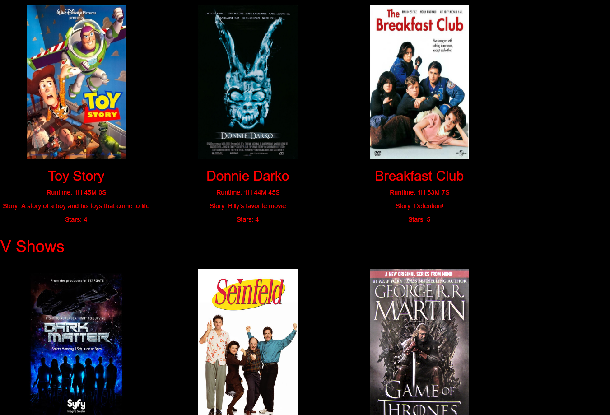

<h1>Table Of Contents</h1>
  <ul>
    <li><a href="#Prerequisites">Prerequisites</a></li>
    <li><a href="#Quick-Start">Quick-Start</a></li>
    <li><a href="#About">About</a></li>
    <li><a href="#Author">Author</a></li>
    <li><a href="#Screenshot">Screenshot</a></li>
  </ul>
<a name="Prerequisites"><h1>Prerequisites</h1></a>
  <ul>
    <li>Download and install <a href="https://www.python.org/downloads/">Python</a> (v2.7.x works best)</li>
  </ul>
<a name="Quick-Start"><h1>Quick Start</h1></a>
<ul>
  <li>Clone this repo</li>
  <li>Navigate to the installed directory</li>
  <li>Click to run "entertainment-center.py"</li>
</ul>
<a name="About"><h1>About</h1></a>
  
This program will create and render a webpage of favorite movies and TV shows.
  If you'd like to edit your own movies or TV shows, please go into the source code
  on entertainment-center.py and read the documentation on adding objects. 

<a name="Author"><h1>Author</h1></a>
  
This program is a project for Udacity's full stack developer nanodegree program.
  This particular project was authored by William Jellesma

<a name="Screenshot"><h1>Screenshot</h1></a>

